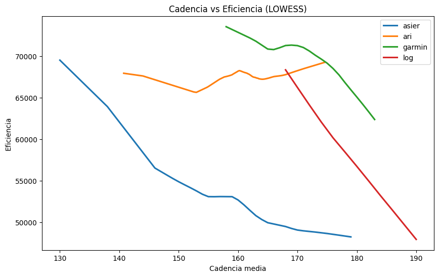
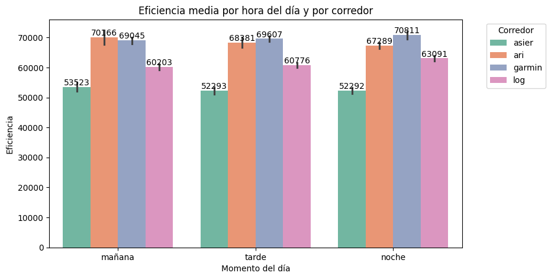
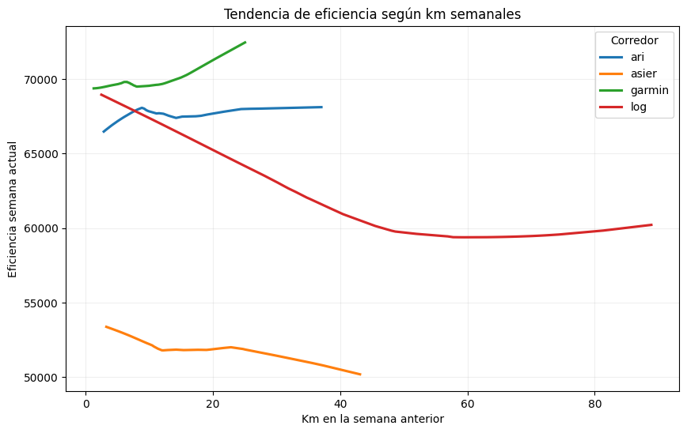

# Running Performance Analysis – Exploratory Data Analysis  
**Autor:** Asier Rodríguez  
**Tecnologías:** Python · Pandas · NumPy · Matplotlib · Seaborn · Statsmodels

---

## Descripción general del proyecto

Este proyecto analiza cómo distintos factores del running influyen en la eficiencia del corredor, utilizando datos reales procedentes de Garmin, Apple Health y Kaggle.

La métrica principal utilizada es la eficiencia, definida como:

efficiency = pace_s_km × avg_hr

Valores más bajos indican mayor rendimiento, ya que representan un buen ritmo con menor frecuencia cardíaca.

El objetivo es validar cuatro hipótesis relacionadas con cadencia, momento del día, kilometraje semanal y longitud de zancada.

**Nota:** Los datasets originales no se incluyen aquí porque contienen datos personales, son muy grandes y algunos proceden de fuentes privadas. El código es totalmente reutilizable con datasets equivalentes.

---

## Definiciones importantes

**Ritmo (pace):** tiempo necesario para recorrer 1 km.  
**Cadencia (cadence):** pasos por minuto.  
**Zancada (stride_length):** distancia recorrida por cada zancada.  
**Volumen semanal (weekly_km):** kilómetros totales realizados en una semana.  
**Eficiencia:** métrica creada para este proyecto combinando ritmo y frecuencia cardíaca media.

---

# 1. Proceso de limpieza de datos

Los datasets presentaban formatos diferentes, por lo que la limpieza fue un paso fundamental:

- Normalización de columnas a snake_case.  
- Conversión de tiempos a segundos.  
- Conversión de elevación con comas a float.  
- Corrección de cadencia doble.  
- Eliminación de valores inválidos.  
- Creación de nuevas variables:  
  - `efficiency`  
  - `pace_min_km`  
  - `time_of_day`  
  - `week_year`  
  - `date_num`

Un dataset (Ganix) fue descartado al no contener variables esenciales como stride_length o la hora del entrenamiento.

---

# 2. Exploratory Data Analysis (EDA)

Incluyó análisis:

- **Univariante:** ritmo, FC, cadencia, zancada, eficiencia.  
- **Bivariante:** eficiencia–cadencia, eficiencia–zancada, km semanales–eficiencia.  
- **Multivariante:** heatmap cadencia × zancada × eficiencia.  
- **Tendencias no lineales:** LOWESS.

---

# 3. Análisis de hipótesis

---

## Hipótesis 1  
### “Existe un rango óptimo de cadencia que maximiza la eficiencia”

Los datos muestran que la eficiencia mejora casi linealmente al aumentar la cadencia.  
No aparece ningún punto óptimo dentro del rango analizado.

**Conclusión:** mayor cadencia → mayor eficiencia.

**Gráfico:**  

---

## Hipótesis 2  
### “Se rinde mejor por la mañana que por la tarde o noche”

Resultados por corredor:

- Asier → mejor por la mañana  
- Ari → mejor por la tarde  
- Garmin → mejor por la noche  

**Conclusión:** la hora del día influye, pero de forma totalmente individual.

**Gráfico:**  

---

## Hipótesis 3  
### “Más kilómetros semanales mejoran la eficiencia la semana siguiente”

Resultados observados:

- Asier → mejora su eficiencia con mayor volumen  
- Ari y Garmin → empeoran, probablemente por fatiga  
- Log → demasiado ruido para conclusiones claras  

**Conclusión:** el impacto del volumen semanal no es universal.

**Gráfico:**  

---

## Hipótesis 4  
### “Una zancada más larga se asocia con mayor eficiencia”

Relación consistente en todos los datasets: a mayor zancada, menor valor de eficiencia.

**Conclusión:** la zancada es uno de los predictores más sólidos del rendimiento.

**Gráfico:**  

---

# 4. Dificultades encontradas

- Formatos muy distintos entre datasets (CSV y JSON).  
- Valores mal formateados (`"1,054"`, `"--"`).  
- Frecuencia cardíaca o cadencia ausentes en algunas sesiones.  
- Columnas duplicadas tras merges.  
- Diferencias de tipos numéricos.  
- Dataset Ari complejo por estructura JSON.

---

# 5. Conclusiones generales

- Las hipótesis se cumplen parcialmente: el rendimiento es altamente individual.  
- La cadencia no presenta un punto óptimo: siempre mejora la eficiencia.  
- La zancada es el predictor más estable y consistente.  
- La hora del día influye según el corredor.  
- El volumen semanal solo beneficia a algunos corredores.  
- La calidad del dato y la limpieza exhaustiva son claves en un EDA real.

---

# 6. Trabajo futuro

- Integración de datos meteorológicos.  
- Normalizar eficiencia según tipo de entrenamiento.  
- Crear modelos predictivos.  
- Dashboard interactivo (Streamlit/Plotly).  
- Añadir más corredores para análisis comparativos.

---

# 7. Referencias

- Garmin Connect  
- Apple Health Export  
- Kaggle – runner_log  
- Pandas, NumPy, Seaborn, Matplotlib  
- Statsmodels LOWESS  

---